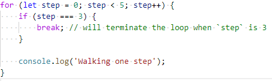
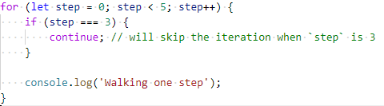

# Telerik Academy JavaScript - {Buddy Group Name} Learning Guide

The **learning guide** is a collection of learning objectives and sample theoretical questions for each of the topics, that collectively answer the question "what to learn?". This guide is an outline of the overall expectations we have for each student at the end of the specific module. You can find those questions and objectives in the beginning of each topic.

**Learning objectives**

A learning objective is a statement of what students will be able to do when they have researched and completed all activities in a topic. Learning objectives are a clear and measurable way of determining if you know, understand, can apply, can analyze and can evaluate a specific content. They follow _Bloom's Taxonomy_.

**Theoretical questions**

These are questions that will most likely be asked during the progress meetings and during the technical part of your job interviews. The idea of these questions is to provide the student an accurate way of determining if they know the key concepts behind each topic.

## JavaScript Core

### Loops / Arrays 

#### **Learning Objectives**

1. Explain how loops work and what is the role of the 'break' and 'continue' .
2. Solve basic judge tasks that require the usage of loops.
3. Analyze the proper type of loop you should use for a given task.
4. Demonstrate the usage of the most common array methods.
5. Solve basic judge tasks that require the usage of arrays.
6. Explain what git is and, in simple terms, how it works.
7. Demonstrate the usage of git with a local and with a remote repository.
8. Create and manage GitLab repositories and their collaborators.

<br/>

#### **Theoretical Questions**

- What is a loop? What types of loops do you know?

  - A _loop_ in programming is a way to repeat an action number of times. The different loop mechanisms offer different ways to determine the start and end points of the loop. In JavaScript we have the **basic** loops (for, while, do-while), as well as a couple of **advanced** loops (for-in, for-of).

  <br/>

  1. **for** statement

      A **for loop** repeats until a specified condition evaluates to false. The JavaScript for loop is similar to the Java and C for loop.

      _Example:_

      ```js
      for (let step = 0; step < 5; step++) {
        console.log('Walking one step');
      }
      ```

  2. **while** statement

      A **while** loop executes its statements as long as a specified condition evaluates to **true**.

      _Example:_

      ```js
      let n = 0;
      while (n < 3) {
        n++;
      }
      ```

  3. **do-while** statement

      A **do-while** loop repeats as long as a specified condition evaluates to **true**. The difference with the **while** loop is that this loop will always execute at least one time.

      _Example:_

      ```js
      let n = 0;
      do {
        n++;
      } while (n < 3);
      ```

  4. **for-in** statement

      A **for-in** loop iterates a over all the enumerable properties of an object. For each distinct property, JavaScript executes the specified statements.

      _Example:_
      ```js
      const person = { name: 'John', age: 23 };
      for (let prop in person) {
        console.log(prop); // name, age
      }
      ```

  5. **for-of** statement

      A **for-of** loop iterates over only iterable objects (including _Array_, _Map_, _Set_, _arguments object_, etc.), invoking a custom iteration hook for the value of each property.

      _Example:_
      ```js
      const numbers = [3, 5, 7, 9];
      for (let number of numbers) {
        console.log(number); // 3, 5, 7, 9
      }
      ```

  <br/>

  - In loops there are 2 special statements that can be used - **break** and **continue**. **break** will immediately terminate the loop's execution, while **continue** will only skip the current iteration.

    `break` _example:_

    
    <br/>

    `continue` _example:_
    
    
    <br/>

  - Additional resources:
    - [MDN Loops](https://developer.mozilla.org/en-US/docs/Web/JavaScript/Guide/Loops_and_iteration)
    - [W3Schools Loops](https://www.w3schools.com/js/js_loop_for.asp)

  <br/>

----

- What is an array? What are the benefits of using arrays over using several variables?

  - An _array_ is...
